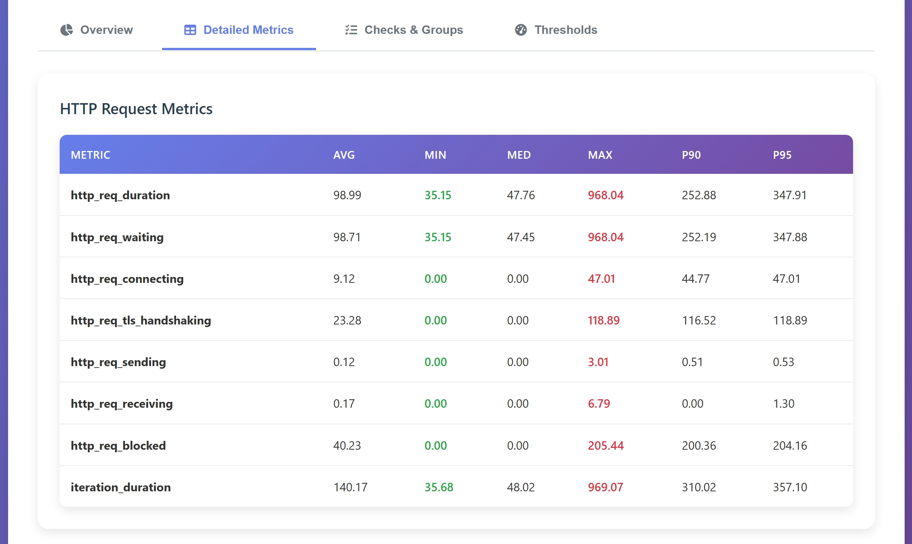
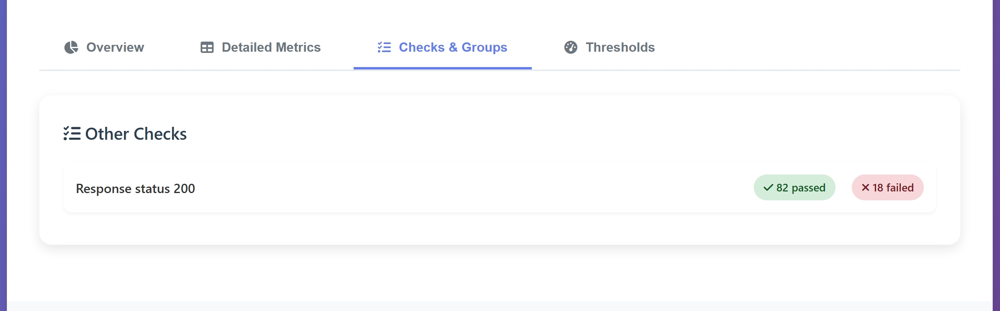
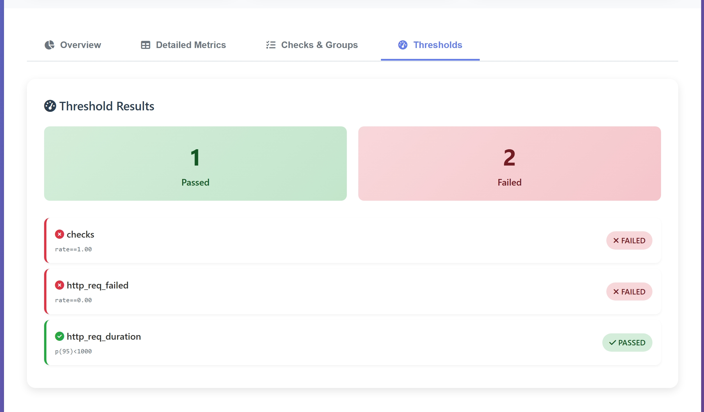

# k6-html-reporter

A modern HTML reporter for [k6](https://k6.io/) performance tests. Generates beautiful, self-contained HTML reports with interactive tabs, charts, and detailed metrics.

## Features

- **Self-contained** — single HTML file with no external dependencies (except Font Awesome icons via CDN)
- **Responsive design** — gradient UI that looks great on any screen size
- **Interactive tabs** — Overview, Detailed Metrics, Checks & Groups, Thresholds, Test Info
- **Visual stat cards** — color-coded request counts, success rates, response times, VU counts
- **Progress bars** — animated success/error rate indicators
- **Pass/fail header** — header gradient changes green/red based on overall test outcome
- **Threshold reporting** — summary cards + per-threshold pass/fail detail
- **Recursive group support** — checks in nested k6 groups are counted correctly
- **Custom metadata** — display arbitrary key-value pairs via `additionalInfo`
- **XSS-safe** — all user-provided text is HTML-escaped

## Installation

```bash
npm install @zenturing/k6-html-reporter
```

Or copy `k6-html-reporter.js` and `k6-html-reporter.d.ts` directly into your k6 project.

## Quick Start

Add `handleSummary` to your k6 test script:

```typescript
import { htmlReport } from '@zenturing/k6-html-reporter';

export function handleSummary(data) {
    return {
        'report.html': htmlReport(data),
    };
}
```

## Usage with Options

```typescript
import { htmlReport } from '@zenturing/k6-html-reporter';

export function handleSummary(data) {
    return {
        'report.html': htmlReport(data, {
            title: 'My Load Test',
            subtitle: 'https://api.example.com/users',
            httpMethod: 'GET',
            additionalInfo: {
                Environment: 'staging',
                'Build Number': 42,
            },
            debug: false,
        }),
    };
}
```

## Dynamic Report File Names

Generate timestamped reports so you can keep a history of runs:

```typescript
import { htmlReport } from '@zenturing/k6-html-reporter';

export function handleSummary(data) {
    const timestamp = new Date().toISOString().replace(/:/g, '-');
    return {
        [`./reports/report-${timestamp}.html`]: htmlReport(data, {
            title: `Load Test — ${new Date().toLocaleString()}`,
        }),
    };
}
```

## Options

| Option           | Type     | Default             | Description                                      |
|------------------|----------|---------------------|--------------------------------------------------|
| `title`          | string   | Current timestamp   | Report title shown in the header                  |
| `subtitle`       | string   | —                   | Subtitle or endpoint description                  |
| `httpMethod`     | string   | —                   | HTTP method badge (GET, POST, PUT, DELETE, PATCH) |
| `additionalInfo` | object   | `{}`                | Key-value pairs shown in the Test Info tab        |
| `debug`          | boolean  | `false`             | Log raw k6 data to console for troubleshooting    |

## Report Sections

### Overview
High-level performance summary with animated progress bars for success/error rates and response time breakdown (min, avg, p95, max). Also shows data transfer stats.

### Detailed Metrics
Table of all HTTP timing metrics: `http_req_duration`, `http_req_waiting`, `http_req_connecting`, `http_req_tls_handshaking`, `http_req_sending`, `http_req_receiving`, `http_req_blocked`, and `iteration_duration`. Shows avg, min, med, max, p90, and p95 for each.

### Checks & Groups
All k6 checks organized by group, with pass/fail counts and color-coded badges.

### Thresholds
Summary cards showing total passed/failed thresholds, followed by per-threshold detail with the threshold expression and pass/fail status.

### Test Info
Only appears when `additionalInfo` is provided. Displays a clean table of your custom key-value metadata.

## Screenshots





## TypeScript Support

Full TypeScript definitions are included. The `ReportOptions` interface provides autocomplete and type checking for all options.

```typescript
import { htmlReport, ReportOptions } from '@zenturing/k6-html-reporter';

const opts: ReportOptions = {
    title: 'API Performance Test',
    httpMethod: 'POST',
};
```

## License

MIT